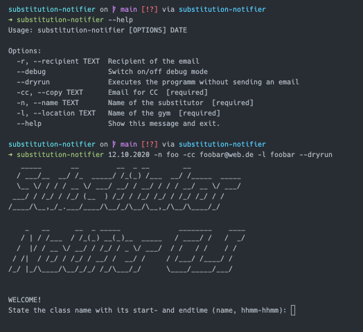

# Subsitution Notifier CLI

## Motivation

As a groupfitness instructor I teach a couple of classes per week such as Hot Iron, CoreXpress, Indoor Cycling, Step and much more. Sometimes I require a colleague that substitutes me since I educate other people on weekends or I am on vacation. With that being said I wanted to simplify the information and communication process between me, the groupfitness supervisor and my substitutor since it is very repetitive task and only slightly changes in the content.

## Workflows

### Formerly:

Open mail program --> Add recipient (groupfitness supvervisor) --> Add cc (supervisor) --> State subject --> Write email content --> Send email

### Now:

Open cli --> Write `$ substitutor-notifier ...` --> Email being sent automatically

## Requirements

- Python >= 3.8
- Adjust `src/lib/templates/config_template.py`-file with your values, rename it to `config.py` and move it to `src/lib/config.py`
- `src/lib/creds/credentials.json`-file after activating the Gmail API (https://developers.google.com/gmail/api/quickstart/python)

## Getting started

1. Clone the repository.
2. Move into the root of project and run `$ pip install .` and `setup.py` will handle the rest.

## Screenshot

